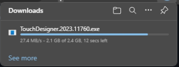
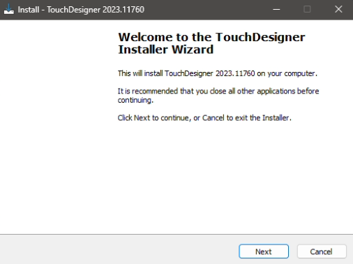
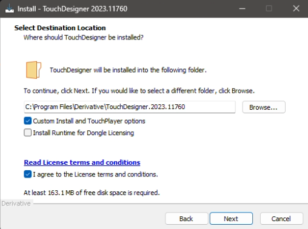
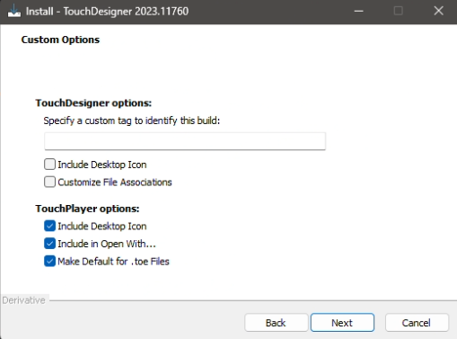
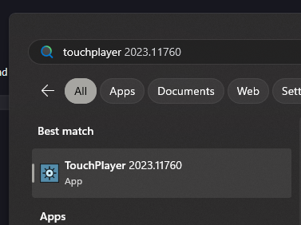
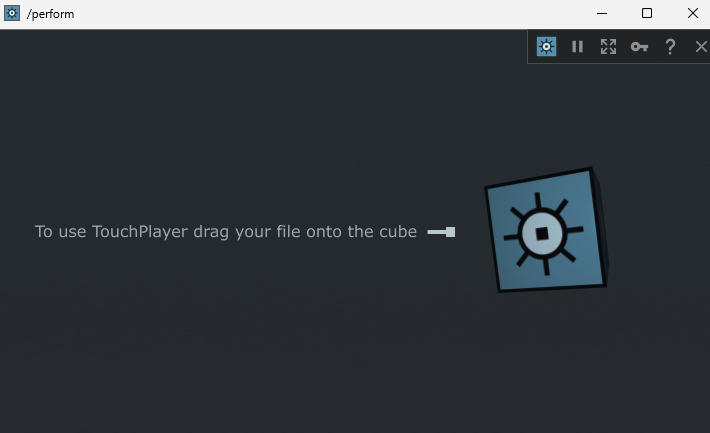
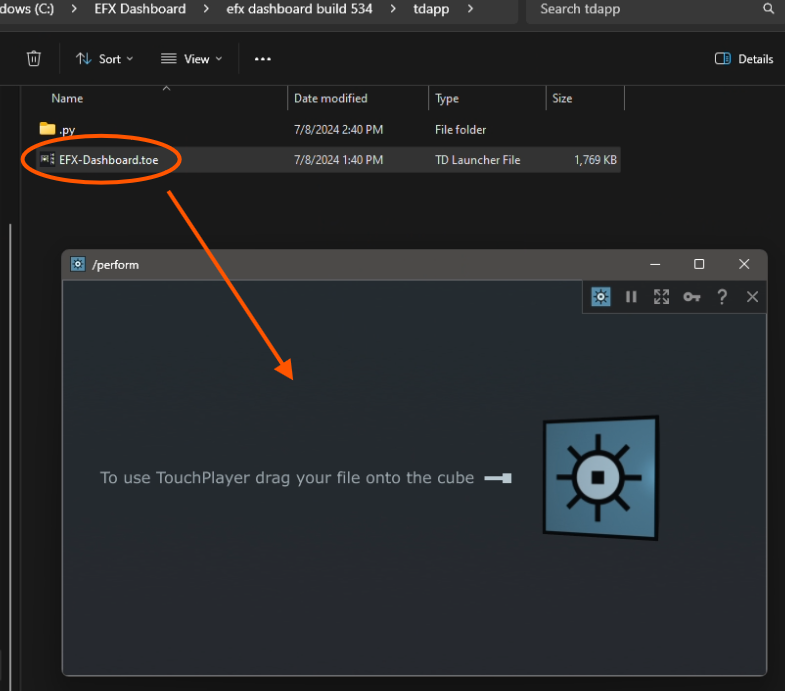
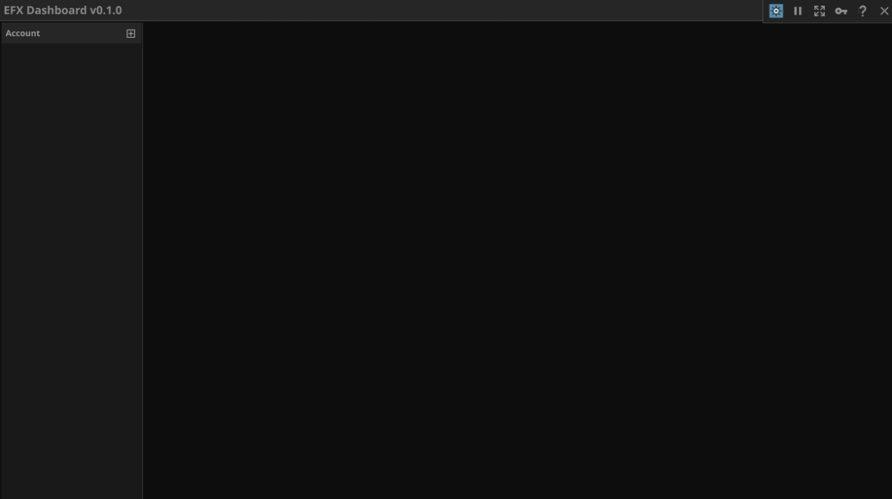

# EFX-Dashboard

A desktop application for tracking and aggregating the performance of your MetaTrader 4 Expert Advisors.

EFX Dashboard digests raw TSV data from metatrader 4, and displays statistics about it. To get TSV data into EFX Dashboard, you must use the EFX Publisher EA. This EA is included in the EFX Dashboard download and will publish the account data of your choosing, grouped by EA to either disk (local) or webrequest (cloud server).

## Features

- Link multiple automatically updating MetaTrader 4 account reports.
- Use the EFX publisher EA (included) to publish your account reports.
- Local Mode (privacy focused, free)
- Cloud Mode (aggregate multiple accounts, ease of use, paid)
    - **coming soon**

## Installation & Usage

EFX Dashboard application at the moment requires a windows machine to run. It will not run well or at all on a VPS, as it needs some basic level of video drivers to work. This means intel integrated graphics, or nvidia/amd dedicated graphics etc.

### 1) Install TouchDesigner

EFX Dashboard is built with TouchDesigner, you'll need it to run the application.

Download it from here: https://download.derivative.ca/TouchDesigner.2023.11760.exe

Be sure to check the following boxes during installation:

Let the install continue, it will take several minutes.

### 2) Launch TouchPlayer

Installing TouchDesigner actually installs two things, TouchDesigner and TouchPlayer. If you are here for EFX Dashboard and have never heard of TouchDesigner, don't worry. You don't need to know how to use it. 

Just open your start menu, and search for TouchPlayer. Open it.

You should see a window like this.

### 3) Download EFX Dashboard & Publisher

Get the latest release from the releases area on this github page, or just download the zip file here:

https://github.com/EnviralDesign/EFX-Dashboard/releases/download/v0.1.0/efx.dashboard.build.534.zip

Unzip the archive, and place the folder somewhere you prefer. I use c:/efxdash etc.

### 4) Launch EFX Dashboard

Simply drag EFX Dashboard onto TouchPlayer, or right click and open with TouchPlayer.

Eventually EFX Dashboard will open, and you'll see a window like this:

### 5) EFX Publisher Installation & Usage

EFX Dashboard is nothing with out a data source. 