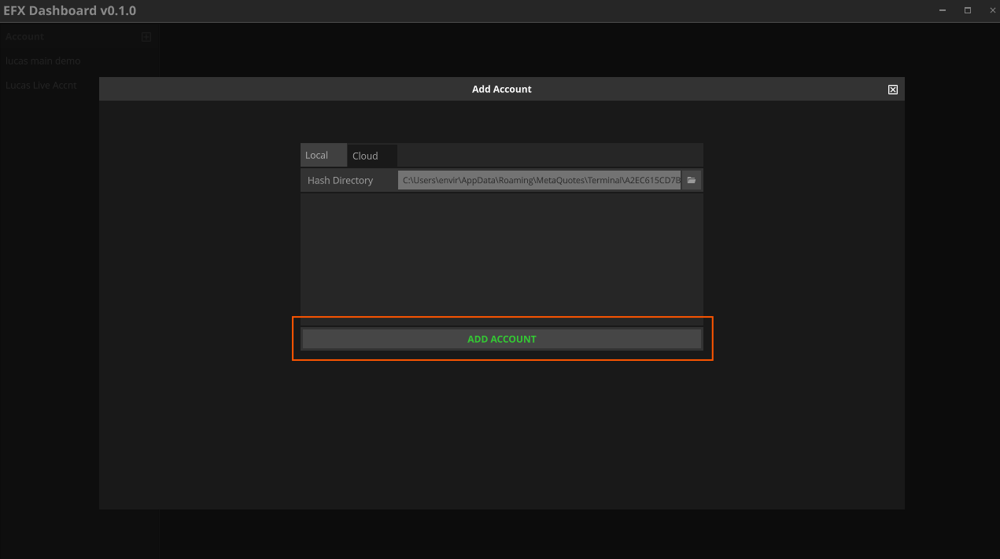

# EFX-Dashboard

> For support, chat, community etc: [Enviral-FX Website / Telegram](https://www.enviral-fx.com/)

A desktop application for tracking and aggregating the performance of your MetaTrader 4 Expert Advisors.

EFX Dashboard digests raw TSV data from metatrader 4, and displays statistics about it. 

To get TSV data into EFX Dashboard, you must use the EFX Publisher EA. This EA is included in the EFX Dashboard download and will publish the account data of your choosing, grouped by EA to either disk (local) or webrequest (cloud server).

EFX Dashboard uses hashing to generate unique identifiers for a trade report/account data set. Your hash is important, for local account analysis only, it's nothing more than a unique ID for that account/report. For cloud usage, it's quite a bit more important as to share your results with others, currently you must share this hash / unique id. Then, someone else with that hash and a valid EFX server API key, can link your results to their own EFX Dashboard and receive live updates as well.

## Features

- Link multiple automatically updating MetaTrader 4 account reports.
- Use the EFX publisher EA (./media/included) to publish your account reports.
- Local Mode (privacy focused, free)
- Cloud Mode (aggregate multiple accounts, ease of use, paid)
    - **coming soon**

## Installation & Usage

EFX Dashboard application at the moment requires a windows machine to run. It will not run well or at all on a VPS, as it needs some basic level of video drivers to work. This means intel integrated graphics, or nvidia/amd dedicated graphics etc.

### 1) Install TouchDesigner

EFX Dashboard is built with TouchDesigner, you'll need it to run the application.

Download it from here: https://download.derivative.ca/TouchDesigner.2023.11760.exe

Be sure to check the following boxes during installation:

Let the install continue, it will take several minutes.

### 2) Launch TouchPlayer

Installing TouchDesigner actually installs two things, TouchDesigner and TouchPlayer. If you are here for EFX Dashboard and have never heard of TouchDesigner, don't worry. You don't need to know how to use it. 

Just open your start menu, and search for TouchPlayer. Open it.

You should see a window like this.

### 3) Download EFX Dashboard & Publisher

Get the latest release from the releases area on this github page, or just download the zip file here:

https://github.com/EnviralDesign/EFX-Dashboard/releases/download/v0.1.5/efx.dashboard.build.590.zip

Unzip the archive, and place the folder somewhere you prefer. I use c:/efxdash etc.

### 4) Launch EFX Dashboard

Simply drag EFX Dashboard onto TouchPlayer, or right click and open with TouchPlayer.

Eventually EFX Dashboard will open, and you'll see a window like this:

### 5) EFX Publisher Installation

EFX Dashboard is nothing with out a data source. Next we'll setup EFX Publisher in MetaTrader 4.

Open up your data folder from metatrader 4, and navigate into the Experts Directory.

Copy `EFX-Account-Publisher-EA-1.2.ex4` into this directory.

### 6) EFX Publisher Usage

EFX Publisher has a lot of repeat parameters for trade groups, but the core settings at the top are the most important and smaller in number.

#### Time Period for trade aggregation

Specify the start date/time and end date/time that you want to collect trades between. If your mt4 account has trades that were opened before the start date, they won't be included. If your account has newer trades than the end date, those will not be included either.

It uses the open time of the trade not close time.

#### Comment Filter

Default settings here are typically fine, but if you have specific EA's or types of positions that you want excluded, either for performance or privacy reasons, you can specify them here.
This filter field supports multiple entries, each entry is separated by a semicolon.

Each filter item uses partial pattern matching if you wish, or you can specify the exact comment.

the default value of `cancelled;bc;` actually means the following patterns will be excluded:

- cancelled
- bc

keep in mind, you do not HAVE to exclude anything, but things you exclude by way of this filter will never leave the mt4 terminal.

#### Simulated Initial Balance (Optional)

If you specify a value other than 0, this will activate this feature in EFX Dashboard. It's useful for when you are testing many different EA's on a large demo account, but want to see certain metrics like drawdown % or gain % in relation to a smaller account size.

The way this works, is when this value is > 0, it will represent your account balance on the starting date that you have specified above. As your closed trades add up, this initial balance will grow from the simulated value you have specified.

If you leave this as 0, then your real account balance as it was on the start date will be used instead.

#### Report Label (Optional)

Use this to give your report a name. Otherwise, it will default to an autogenerated name.

#### Magic String

When you setup EFX publisher, there are a number of parameters that are used in combination to generate the unique hash identifier. These are as follows:

- accountNumber
- accountName
- accountCompany
- accountServer
- MagicString

There may be times when you want to publish similar account data, but not have it overwrite the previous report. This is where the magic string comes in. The Magic String is incorporated into the hashing function to help create unique hashes. so if you change nothing else about your publisher settings, but you change the magic string even slightly, the resulting hash id will be different.

In practice, if you are only planning to track a single account, you can leave this blank. If you are tracking more than one, just to be safe always give each instance a unique magic string.

#### Anonymize Name / Account Number

Set this to true if you want your account number and real name to be anonymized in the report. This is useful for sharing your report with others, but not wanting to reveal your account number or real name.

#### Update Period

you can set this value to anything you want, but values less than 30 seconds will be clamped at 30. This is to prevent the EA from spamming the server or your disk with too many requests.

#### Enable Local Disk Publishing

If you plan to use EFX Dashboard in local mode, you'll want this to be true. When it's enabled, it will write all files neccesary to a new directory within your metatrader 4 data folder. The folder url will look something like this: 

`C:\Users\<USER>\AppData\Roaming\MetaQuotes\Terminal\<MT4_DATA_FOLDER>\MQL4\Files\<EFX_HASH_DIRECTORY>`

inside, are 3 files.

- account.tsv
- config.tsv
- data.tsv

When running EFX dashboard in local mode, you'll want to copy the entire hash name of the folder and paste it into the EFX Dashboard application when prompted.

#### Enable Cloud Publishing (Coming Soon)

If you are familiar with FX Blue, this feature of EFX Dashboard works similarly. I run a cloud server that can accept your web requests from EFX Dashboard, and allow you to share your results with others. This will be a paid feature, and requires a valid API key to use.

#### Webrequest URL (Coming Soon)

you will need a valid web url to send web requests to. This information will become available at a later date when this feature is publicly available.

#### API Key (Coming Soon)

similarly, you will need a valid API key for the server to accepts your requests to either publish or retrieve data from the cloud server.

#### Web Request Timeout

How many miliseconds to wait for a response from the server before timing out. If you are dealing with very large amounts of historical trading data, you may need to increase this value.

#### Trade Group [1-50] Settings

There are 50 entries for trade groups, which means you can specify up to 50 different EA's or trade groups to be published. Each trade group has the following parameters:

- Title
- Comment Filter
- Magic Filter

The comment filter can support multiple entries, separated by a semicolon. Each entry can be a partial match or an exact match. `*` is a wildcard character. Here are a few examples of comment filters:

- `MySpecialEA*` will match any comment that starts with `MySpecialEA`, so `MySpecialEA-1` and `MySpecialEA-2` would both match.
- `GridEA-Entry;GridEA-Add*` will match any comment that is exactly `GridEA-Entry` or starts with `GridEA-Add`, such as `GridEA-Entry` or `GridEA-Add-1`, `GridEA-Add-2`.
- `*OscilatorEA*` will match any comment that contains `OscilatorEA` anywhere in the comment. So `OscilatorEA123` and `premarket-OscilatorEA-1` would both match.

The magic filter allows you to match any number of magic numbers. Here are a few examples of magic filters:

- `1000` will match any magic number that is exactly `1000`.
- `1000,1001,1005` will match any magic number that is `1000`, `1001`, or `1005`.
- `100,101,102-105,110` will match any magic number that is `100`, `101`, `102`, `103`, `104`, `105`, or `110`.
- `100-200` will match any magic number that is between `100` and `200` inclusive.

Generally, you should opt to specify only comment filters, or only magic filters, but you can do both if you want to be very specific. but avoid that if possible, and try and use comment filters where possible, because they are the most portable and flexible usually.

If you leave magic filter empty, but fill in comment filter, it will only consider the comment filters, and vice versa if you only specify magic filters.

Title has no bearing on filtering at all, it is purely a label for you to identify the trade group in EFX Dashboard.

### 7) Linking Reports to EFX Dashboard

The last step is to link your reports to EFX Dashboard. 

There are two methods to do this, Local Mode and Cloud Mode.

In both cases, you need to get the hash code that is generated when you successfully configure EFX Publisher on your chart. Be sure to wait until you've configured it correctly.

#### LOCAL MODE

Be sure you have enabled saving to disk in EFX Publisher.

Make note of the last few characters of your Hash code. It will be printed in the chart:

You'll then want to navigate to your data folder, and go into the Files directory, and find the matching hash code directory. You can copy the full path to this directory.

Then from within EFX Dashboard, click the `+` button in the top left corner next to "Account"

Next, click browse, or just paste the copied path into the text field:

THen click add/accept:

You should see the account appear in the list on the left. If you ever want to remove a linked account, click on the account page, and then click on remove account from dashboard.

#### CLOUD MODE (Coming Soon)

Be sure web publishing is enabled in EFX Publisher. You'll also need the valid url and api key.

Make note of the last few characters of your Hash code. It will be printed in the chart:

Or alternatively, open your terminal, and go to the Experts tab, and look for this line. right click and copy it, then paste it into notepad, and copy out just the hash code part.

Then from within EFX Dashboard, click the `+` button in the top left corner next to "Account"

then click the cloud button, and enter the hash and api key details, and click add/accept account.

You should see the account appear in the list on the left. If you ever want to remove a linked account, click on the account page, and then click on remove account from dashboard.

